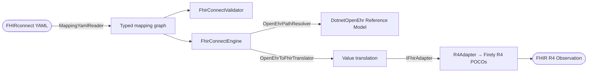

# Architecture

A high-level tour of the seams inside `dotnet-fhirconnect` and why
they exist.

## Data flow

The forward (openEHR → FHIR) direction is end-to-end today. The
reverse direction is documented in [getting-started.md](getting-started.md#known-v0x-limitations);
the seams below are designed to support it once an inverse path
resolver lands.

## Layered units

### 1. Loader (`DotnetFhirConnect.Mappings` + `Internal.MappingYamlReader`)

- One streaming YAML parse per file via `YamlStream`/`YamlNode` (no
  reflection-driven deserializer — AOT-conscious).
- Produces typed records: `ModelMapping`, `ContextMapping`,
  `ExtensionMapping`, all sharing `FhirConnectMapping`.
- `MappingBundle` aggregates a project directory.
- Rejects unsupported grammar declarations with
  `FhirConnectFormatException` carrying the offending string and
  file path.

### 2. Validator (`DotnetFhirConnect.Validation`)

- Shares the loader's YAML parse via `MappingYamlReader.ReadDocument`.
- Converts the raw tree to `JsonNode` via the in-house
  `YamlJsonBridge`, indexing every JSON pointer back to a YAML
  `Mark` for source-locating issues.
- Drives `JsonSchema.Net` against the embedded FHIRconnect v1.0.0
  schemas (patched copies of upstream — see
  `tests/fixtures/spec-schemas/PROVENANCE.md`).
- Adds semantic checks on top: grammar, `spec.system`,
  `spec.version`, openEHR archetype-id regex, `context.start ∈
  context.archetypes`.
- Emits `ValidationIssue` records: JSON pointer + line/column +
  severity + stable code (`FCV001`-`FCV900`).

### 3. FHIR adapter seam (`DotnetFhirConnect.Fhir`)

- `IFhirAdapter` traffics in `object` for resources because the three
  Firely packages (`Hl7.Fhir.R4` / `R4B` / `R5`) each define their
  own `Resource` base type with no shared assembly.
- `R4Adapter` implements parse/serialize/create + a switch-driven
  path resolver for the `Observation` properties the vital_status
  walking-skeleton mapping touches.
- `R4BAdapter` and `R5Adapter` are pending stubs that throw
  `NotImplementedException` with release-tagged messages.
- `FhirAdapterFactory.Create(FhirRelease)` picks the right
  implementation from the bundle's `spec.version`.
- Typed convenience facades (`R4Engine` today; `R4BEngine` /
  `R5Engine` when those adapters land) layer typed `Resource`
  returns on top of the `object`-typed core.

### 4. Engine (`DotnetFhirConnect` + `DotnetFhirConnect.Engine`)

- `FhirConnectEngine` constructs the right adapter from the bundle's
  model mapping and dispatches to `MappingRuleExecutor`.
- `BindingContext` is an immutable record carrying the resolution
  context for the FHIRconnect path prefixes (`$composition`,
  `$archetype`, `$openEHRRoot`, `$resource`, `$fhirRoot`).
- `MappingRuleExecutor` walks `ModelMapping.Mappings`, dispatches
  by rule kind, mutates the FHIR side via the adapter. v0.x
  handles: direct, manual, followedBy (with collection iteration
  for `type: NONE` wrappers), link, unidirectional, fhirCondition.
- `OpenEhrPathResolver` is a thin wrapper around
  `DotnetOpenEhr.Aql.ArchetypePathResolver` plus a small
  fallback for SDK gaps (e.g. `Locatable.Links` not exposed on
  Entry subtypes by the SDK's `PathNavigator`) and non-`Pathable`
  RM types (`Participation`).
- `OpenEhrToFhirTranslator` narrows openEHR `Dv*` values into the
  shapes the R4 adapter writers expect — `DvCodedText →
  CodeableConcept`, `DvDateTime → FhirDateTime`, `DvEhrUri →
  ResourceReference` with `ehr:///compositions/<uuid>` rewrite.

## CLI seam (`DotnetFhirConnect.Cli`)

- `System.CommandLine` v3-preview builds a `RootCommand` with two
  sub-commands: `validate` and `transform`.
- The verbs are thin wrappers around the library; exit codes follow
  `sysexits.h` (0 success, 1 validation failed, 2 io/parse, 3
  transform error, 64 usage error).
- The in-process test harness drives the root command via
  `ParseResult.Invoke(InvocationConfiguration)` with `Output` /
  `Error` redirected to `StringWriter`. No spawning `dotnet run`.

## Trim / AOT posture

- Shipping projects under `src/` set `_IsShippingProject=true`
  (via `src/Directory.Build.props`), which turns on
  `EnableTrimAnalyzer`, `IsTrimmable`, and `IsAotCompatible` plus
  the package metadata block in the root `Directory.Build.props`.
- Public entry points that route through Firely, YamlDotNet, or
  reflection-bound dispatch are decorated with
  `[RequiresUnreferencedCode]`. The library is **not**
  AOT-publishable in v0.x; that's a documented v0.x trade-off, not
  a permanent stance.

## Why these seams (and not others)

- **`IFhirAdapter` over `object`, with typed facades on top.** The
  natural seam (`IFhirAdapter<TResource>`) is impossible because
  Firely's three packages don't share a `Resource` base. The
  `object` seam + typed facade pattern is the cleanest workaround
  that keeps engine code release-agnostic.
- **`MappingYamlReader.ReadDocument` shared by loader + validator.**
  Parsing each file twice would let the two surfaces drift on
  YAML-level semantics (`!!int` inference, scalar style handling,
  etc.). Single-parse, dual-projection guarantees they cannot.
- **Engine walks against `DotnetOpenEhr.Aql.ArchetypePathResolver`
  rather than a hand-rolled tree walker.** The `featurerequest.md`
  spec lock said "use AQL from day one" — re-implementing AQL
  predicate semantics, archetype-id matching, and the
  generic-RM-attribute switch is exactly the duplicate work the
  SDK dependency exists to prevent.
- **`R4Adapter`'s switch-driven path resolver instead of
  `FhirPathCompiler` writes.** FhirPath is a query language, not
  an assignment language. Routing writes through it requires the
  ElementModel adapter dance which adds AOT-warning surface for
  zero v0.x benefit.
